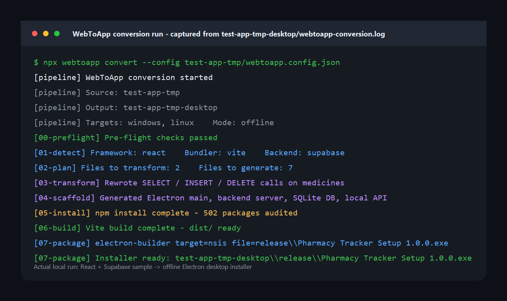

# WebToApp

> Convert AI-generated web apps into offline desktop apps — automatically.

[](https://github.com/jeff2450/desktop-to-app/actions/workflows/ci.yml)
[](https://www.npmjs.com/package/@webtoapp/cli)
[](./LICENSE)
[](https://nodejs.org/)

Supports **React + Vite**, cloud backends (**Supabase**, **Firebase**), auth providers (**Clerk**, **Auth0**), and builds native installers for **Windows**, **Linux**, and **macOS**.

---

## Quick start

```bash
# In your existing web project root:
npx webtoapp init        # create webtoapp.config.json
npx webtoapp convert     # run the full pipeline

# Check system dependencies first:
npx webtoapp doctor
```

## Demo run



Captured from `test-app-tmp-desktop/webtoapp-conversion.log`: the sample app is detected, transformed, scaffolded, built, and packaged as `Pharmacy Tracker Setup 1.0.0.exe`.

---

## How it works

```
Source project (React + Supabase)
          │
          ▼
  00-preflight→  Validates config + project structure (fail-fast)
  01-detect   →  Identifies framework, backend, auth, tables
  02-plan     →  Decides what to transform, copy, generate
  03-transform→  Rewrites cloud SDK calls → local API (AST-based)
  04-scaffold →  Generates Electron main, backend server, SQLite DB
  05-install  →  Merges package.json, runs npm install
  06-build    →  Runs vite build (patches base: './' for Electron)
  07-package  →  Runs electron-builder → .exe / .AppImage / .dmg
          │
          ▼
  Output: MyApp Setup 1.0.0.exe  ✔
```

---

## Architecture

```
┌─────────────────────────────────────────────────────────┐
│                     @webtoapp/cli                        │
│   npx webtoapp init | convert | doctor | dev | login    │
└───────────────────────┬─────────────────────────────────┘
                        │
          ┌─────────────▼──────────────┐
          │      @webtoapp/core         │
          │   ConversionPipeline        │
          │   PipelineContext           │
          │   Stages 00 → 07            │
          └──┬──────────┬──────────────┘
             │          │
   ┌──────────▼──┐  ┌───▼────────────┐
   │ @webtoapp/  │  │  @webtoapp/    │
   │ detectors   │  │  transformers  │
   │             │  │                │
   │ • Supabase  │  │ • Supabase     │
   │ • Firebase  │  │ • Firebase     │
   │ • Clerk     │  │ • Clerk        │
   │ • Auth0     │  │ • Auth0        │
   │ • Schema    │  │ • Vue          │
   └─────────────┘  │ • AI fallback  │
                    └────────────────┘
             │
   ┌──────────▼──────────┐
   │  @webtoapp/builder  │
   │  Vite + electron-   │
   │  builder wrapper    │
   └─────────────────────┘

Optional SaaS layer (self-hostable):
┌──────────────┐    ┌──────────────────────────────┐
│  apps/web    │    │         apps/api              │
│  Next.js     │◄──►│  Express + BullMQ + Prisma   │
│  dashboard   │    │  Postgres + Redis + Stripe    │
└──────────────┘    └──────────────────────────────┘
```

---

## Monorepo structure

```
webtoapp/
├── apps/
│   ├── web/          Next.js SaaS dashboard      ✅
│   └── api/          Node.js + BullMQ backend     ✅
├── packages/
│   ├── core/         Pipeline orchestrator        ✅
│   ├── detectors/    Stack detection modules      ✅
│   ├── transformers/ AST code transformers        ✅
│   ├── templates/    Handlebars file templates    ✅
│   ├── builder/      Vite + electron-builder      ✅
│   └── cli/          npx webtoapp CLI             ✅
```

---

## webtoapp.config.json

```json
{
  "name": "My App",
  "version": "1.0.0",
  "appId": "com.example.myapp",
  "source": ".",
  "mode": "offline",
  "targets": ["windows", "linux"],
  "backend": { "type": "auto", "port": 3001 },
  "auth": { "type": "local", "defaultAdmin": "admin@app.local" },
  "database": { "type": "sqlite" }
}
```

| Field | Type | Required | Description |
|-------|------|----------|-------------|
| `name` | string | ✅ | App name shown in installer UI |
| `version` | string | ✅ | SemVer string e.g. `1.0.0` |
| `appId` | string | ✅ | Reverse-domain ID e.g. `com.acme.myapp` |
| `source` | string | ✅ | Path to source project root |
| `mode` | string | ✅ | `offline` \| `online` \| `hybrid` |
| `targets` | array | ✅ | `windows` \| `linux` \| `mac` \| `android` \| `ios` |
| `output` | string | — | Output directory (default: `../myapp-desktop`) |
| `backend.port` | number | — | Local API port (default: `3001`) |
| `auth.defaultAdmin` | string | — | Default admin email for local auth |

---

## Conversion modes

| Mode | Behaviour | Best for |
|------|-----------|----------|
| `offline` | All data stored in local SQLite. No internet needed. | Pharmacy, clinic, field apps |
| `online` | Cloud backend untouched. Electron wrapper only. Internet required. | Apps that must share a live database |
| `hybrid` | Local SQLite + auto-sync to cloud when internet available. | Areas with intermittent connectivity |

---

## Supported stacks

| Layer | Supported |
|-------|-----------|
| **Frontend** | React + Vite ✅, Vue + Vite ✅ |
| **Backend** | Supabase ✅, Firebase ✅ |
| **Auth** | Supabase Auth ✅, Clerk ✅, Auth0 ✅ |
| **Targets** | Windows (.exe) ✅, Linux (.AppImage) ✅, macOS (.dmg) ✅ |
| **Mobile** | Android (Capacitor) ⚠ beta, iOS (Capacitor) ⚠ beta |

---

## Development

```bash
# Prerequisites: Node >=20, pnpm >=9
pnpm install
pnpm build          # build all packages in dependency order
pnpm dev            # watch mode across all packages
pnpm typecheck      # type-check without emitting
pnpm test           # run all tests
```

---

## Running the full stack (Docker)

```bash
cp .env.example .env   # fill in your secrets
docker compose up -d
```

| Service | Description | Port |
|---------|-------------|------|
| `postgres` | PostgreSQL 16 | 5432 |
| `redis` | Redis 7 | 6379 |
| `api` | Express + BullMQ API | 3001 |
| `worker` | BullMQ conversion worker | — |
| `web` | Next.js SaaS dashboard | 3000 |

---

## Troubleshooting

### `npx webtoapp doctor` shows missing dependencies

WebToApp requires **Node.js ≥ 20**, **pnpm ≥ 9**, and platform build tools.

- **Windows:** Install [Visual C++ Build Tools](https://visualstudio.microsoft.com/visual-cpp-build-tools/)
- **Linux:** `sudo apt install build-essential fakeroot dpkg rpm`
- **macOS:** `xcode-select --install`

Run `npx webtoapp doctor` again after installing to verify.

---

### Blank white screen after conversion

Vite's `base` path must be `"./"` for Electron's `file://` protocol. WebToApp patches this automatically, but if your `vite.config.ts` overrides `base`, remove that override.

---

### `supabase` calls still present after transform

Some dynamic or aliased import patterns may not be caught by the AST transformer. Check `webtoapp-report.json` for `SKIPPED` entries, or run:

```bash
npx webtoapp convert --mode online
```

to skip transformation entirely and keep the cloud backend.

---

### `npm ERR! code ENOENT` during install stage

Make sure your source `package.json` doesn't have a `postinstall` script that expects the original cloud environment. Remove or guard it with `if (process.env.WEBTOAPP) return;`.

---

### `electron-builder` fails on Linux with `fpm` error

```bash
sudo gem install fpm
```

Or use the Docker build path which includes all native dependencies.

---

## Sessions completed

| Session | What was built | Status |
|---------|---------------|--------|
| 1 | Monorepo root + `packages/core` pipeline skeleton | ✅ |
| 2 | Detectors + Supabase transformers + stages 03–04 | ✅ |
| 3 | Templates + Builder + CLI + stages 05–07 | ✅ |
| 4 | API backend (Express + BullMQ + Prisma) | ✅ |
| 5 | API services (billing, downloads, auth, jobs) | ✅ |
| 6 | Next.js SaaS dashboard (shadcn/ui + protected routes) | ✅ |
| 7 | Firebase, Clerk, Auth0, Vue transformers + AI fallback | ✅ |
| 8 | DevOps: Docker Compose, multi-stage Dockerfiles, Capacitor | ✅ |

---

## Contributing

See [CONTRIBUTING.md](./CONTRIBUTING.md) for setup instructions, coding standards, and how to submit a PR.

---

## Changelog

See [CHANGELOG.md](./CHANGELOG.md) for version history.

---

## License

[MIT](./LICENSE) © 2024 Japhet Justice Munisi
