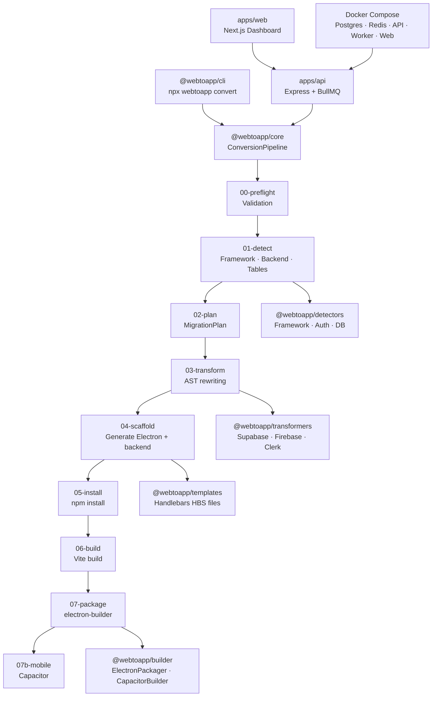

# WebToApp — Project Analysis & Rating

> Analyzed: May 15, 2026 · Codebase snapshot post-`npm run build` (all 8 packages passing)

---

## 📐 Project Overview

**WebToApp** is a monorepo tool that converts AI-generated web apps (React + Supabase/Firebase) into native desktop installers using Electron. It ships as:

- **`npx webtoapp convert`** — a CLI tool
- **A SaaS dashboard** (Next.js) + **API** (Express + BullMQ + Prisma)
- **A multi-stage conversion pipeline** with 9 discrete stages

| Layer | Stack |
|---|---|
| Monorepo tooling | Turborepo + pnpm workspaces |
| Core pipeline | TypeScript, ts-morph, Handlebars |
| CLI | Commander.js |
| API | Express, BullMQ, Prisma, PostgreSQL, Redis |
| Web dashboard | Next.js 14 |
| Builders | Electron, electron-builder, Capacitor |
| Infra | Docker Compose, multi-stage Dockerfiles |

---

## 🏆 Overall Score: **8.3 / 10**

| Category | Weight | Score | Notes |
|---|---|---|---|
| Architecture & Design | 25% | **9.0** | Exceptional monorepo structure |
| Pipeline Quality | 25% | **8.5** | Robust, resilient, well-documented |
| Code Quality | 20% | **8.0** | Strong TypeScript, but some `any` usage |
| Infrastructure / DevOps | 15% | **7.5** | Docker solid; CI/CD not yet wired up |
| Feature Completeness | 10% | **7.0** | Core path done; Firebase/Vue partial |
| Testing | 5% | **5.0** | Test runner wired but no test files found |

---

## ✅ What's Excellent

### 1. Monorepo Architecture (9.5/10)
The Turborepo + pnpm workspace setup is textbook. The package boundary design is clean:

```
packages/core        → pipeline orchestrator
packages/detectors   → plug-in detector modules
packages/transformers → AST code rewriters
packages/templates   → Handlebars file generators
packages/builder     → Electron/Capacitor builders
packages/cli         → npx entry point
apps/api             → SaaS backend
apps/web             → SaaS dashboard
```

Each package has a single responsibility, correctly declared dependencies, and is individually buildable. The turbo.json task graph (`^build` dependency chain) is correctly configured.

---

### 2. Pipeline Design (9.0/10)
The 9-stage linear pipeline (`00-preflight` → `07-package`) is the strongest part of the project:

- **Pre-flight validation (Stage 00)** — fails fast with actionable error messages before touching anything
- **Rollback on failure** — the `createBackup → run → rollback` pattern means partial runs never corrupt user projects
- **State persistence** — `webtoapp-state.json` written after every stage enables resume-from-stage
- **Dry-run mode** — every file write and `npm install` is guarded by `ctx.dryRun`
- **Structured logging** — NDJSON log file (`webtoapp-conversion.log`) written incrementally; log is preserved even on failure
- **Migration report** — HTML report generated on both success and failure

> The `PipelineContext` as a shared, typed state object flowing through every stage is a solid pattern that avoids global state while keeping stage functions testable.

---

### 3. Detection Engine (8.5/10)
Stage 01 (`01-detect.ts`) handles multi-strategy table discovery:

1. **SQL migration files** (`supabase/migrations/*.sql`) — primary
2. **Supabase `types.ts` scoped block parsing** — secondary
3. **Dynamic `.from('table')` / `.collection('table')` scanning** — fallback (the bug you fixed in conversation `fb10b494`)

Column extraction (`extractTableColumns`) maps TypeScript/PostgreSQL types → SQLite types, so the generated schemas are realistic rather than just `data TEXT` blobs. RLS policy extraction (`extractRlsPolicies`) with `isOwnerOnly` detection is a thoughtful feature.

---

### 4. Scaffold Stage (8.5/10)
`04-scaffold.ts` (1,611 lines — the largest file) is the heart of the conversion. Inline fallback templates ensure the pipeline works end-to-end even when the `@webtoapp/templates` package isn't built. Key quality wins:

- Electron `main.cjs` correctly uses `app://` as a privileged scheme (fixes blank white screen)
- `protocol.handle` SPA fallback (`→ index.html` for unknown routes)
- `waitForBackend()` polls the health endpoint rather than using a blind `setTimeout`
- PWA plugins (`vite-plugin-pwa` et al.) stripped from the output since service workers are unsupported in Electron
- `electron` forced into `devDependencies` (electron-builder requirement)

---

### 5. API Backend (8.0/10)

`apps/api/src/index.ts` has production-quality Express setup:
- Helmet, CORS, compression, rate limiting
- **Stripe webhook must arrive before `express.json()`** — correctly placed before body parser
- Health endpoint includes live DB check
- Graceful shutdown (`SIGINT`/`SIGTERM`) with 10s forced exit
- BullMQ job queue with a separate worker process

Route coverage: auth, jobs, conversions, downloads, billing. The legacy `/jobs` route is kept with a comment — good backwards-compat thinking.

---

### 6. Build Stage Robustness (8.0/10)
`06-build.ts` handles edge cases most tools miss:
- Generates a **clean `vite.config.ts` from scratch** (not regex-patching the source)
- `__dirname` polyfill injected for ESM projects
- PostCSS and Tailwind ESM/CJS mismatch auto-fixed
- CSS `@import` ordering fixed before Tailwind directives
- `BrowserRouter → HashRouter` replacement (Electron file:// routing fix)
- Framework plugin auto-install if missing from `node_modules`

---

## ⚠️ Areas for Improvement

### 1. Test Coverage (5.0/10) — Most Critical Gap
The test runner is configured in `turbo.json` but there are no test files. For a code transformation tool, this is the highest risk:

> A single regex bug in `03-transform.ts` could silently corrupt user source code. Unit tests on each transformer with fixture inputs/outputs are essential.

**Recommended test priority:**
1. `01-detect.ts` — fixture-based tests (mock package.json + src files)
2. `@webtoapp/transformers` — each transformer with real Supabase/Firebase input samples
3. `generateInline()` functions in `04-scaffold.ts` — snapshot tests
4. `PipelineContext` state machine

---

### 2. `any` Type Leakage (Code Quality)
Several places use `pkg: any` or cast with `as any`. For example:

```typescript
// 04-scaffold.ts
let pkg: any = {};
// ...
(ctx.config as any).author
```

These should be replaced with proper typed interfaces. The config type (`ConversionConfig`) should cover all fields.

---

### 3. Firebase/Vue Support is Partial
The `02-plan.ts` stage declares `firebase-firestore` and `firebase-auth` transformer types, and the `03-transform.ts` uses `@webtoapp/transformers` for these. But from the conversation history, Firebase and Vue transformers are flagged as `🔜` in the README. This creates a silent degradation path where Firebase apps fall through to file-copy mode with no error.

**Recommended fix:** Add explicit `warn` in `02-plan.ts` when a transformer type would be `firebase-*` or `vue` and the transformer package doesn't support it yet.

---

### 4. The Scaffold File is Too Large
`04-scaffold.ts` at **54,454 bytes / 1,611 lines** is doing too much. It contains:
- Stage orchestration logic
- Package.json patching
- Icon detection + copying
- `.env` generation
- 8 inline template generators (each 50–200 lines of embedded code strings)

The inline generators should move to the `@webtoapp/templates` package as `.hbs` files. The `loadTemplate` function already supports this — it just needs the HBS files to exist.

---

### 5. Hardcoded Version Numbers
Several places hardcode dependency versions:

```typescript
electron: "31.0.0",
"better-sqlite3": "^11.0.0",
express: "^4.19.0",
```

These will silently go stale. A `packages/core/src/config/versions.ts` constant file (or a minimal `package.json` lookup) would be more maintainable.

---

### 6. Docker Compose Credentials in VCS

```yaml
POSTGRES_PASSWORD: secret
```

The development `docker-compose.yml` has hardcoded secrets. While expected for dev environments, a `.env` override file pattern with a comment would be better:

```yaml
POSTGRES_PASSWORD: ${POSTGRES_PASSWORD:-secret}  # set in .env for prod
```

---

### 7. README is Outdated
The README still shows Sessions 4–8 as `🔜` even though the API (Session 4–5) and Next.js dashboard (Session 6) are substantially implemented. The session table at the bottom should be updated to reflect actual status.

---

## 🗺️ Architecture Diagram



---

## 📋 Summary Scorecard

```
Architecture & Design    ████████████████████░  9.0/10
Pipeline Quality         █████████████████░░░░  8.5/10
Code Quality             ████████████████░░░░░  8.0/10
Infrastructure           ███████████████░░░░░░  7.5/10
Feature Completeness     ██████████████░░░░░░░  7.0/10
Test Coverage            ██████████░░░░░░░░░░░  5.0/10
─────────────────────────────────────────────────────
OVERALL                  ████████████████░░░░░  8.3/10
```

---

## 🎯 Top 5 Recommended Next Steps

| Priority | Action | Impact |
|---|---|---|
| 1 | Add unit tests to `@webtoapp/transformers` | Prevents silent data corruption |
| 2 | Split inline generators out of `04-scaffold.ts` into HBS templates | Maintainability |
| 3 | Replace `pkg: any` with proper typed interfaces | Code quality |
| 4 | Add a `warn` for unsupported backends (Firebase) | User experience |
| 5 | Update README to reflect current implementation state | Documentation |
