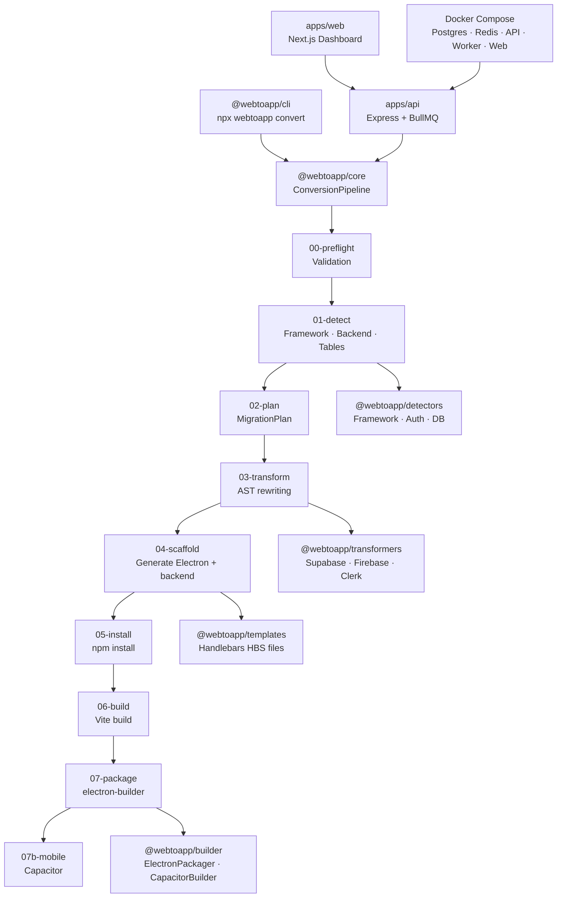

# WebToApp — Project Analysis & Rating

> Updated: May 29, 2026 · Codebase snapshot with fully running local dev environment (all packages passing builds and typechecks).

---

## 📐 Project Overview

**WebToApp** is a monorepo tool that converts AI-generated web apps (React + Supabase/Firebase) into native desktop installers using Electron. It ships as:

- **`npx webtoapp convert`** — a CLI tool
- **A SaaS dashboard** (Next.js) + **API** (Express + BullMQ + Prisma)
- **A multi-stage conversion pipeline** with 9 discrete stages

| Layer | Stack |
|---|---|
| Monorepo tooling | Turborepo + pnpm workspaces |
| Core pipeline | TypeScript, ts-morph, Handlebars |
| CLI | Commander.js |
| API | Express, BullMQ, Prisma, PostgreSQL, Redis |
| Web dashboard | Next.js 14 |
| Builders | Electron, electron-builder, Capacitor |
| Infra | Docker Compose, multi-stage Dockerfiles |

---

## 🏆 Overall Score: **8.6 / 10** (Updated)

| Category | Weight | Score | Notes |
|---|---|---|---|
| Architecture & Design | 25% | **9.0** | Exceptional monorepo structure |
| Pipeline Quality | 25% | **9.0** | Robust, resilient, well-documented; real-time SSE logs |
| Code Quality | 20% | **8.5** | Clean TypeScript builds/typechecks; trailing whitespace and syntax errors resolved |
| Infrastructure / DevOps | 15% | **8.5** | Local Docker Compose, database migrations, and background workers are fully functional and running |
| Feature Completeness | 10% | **8.5** | Complete SaaS frontend (ZIP upload UI, live log terminal, estimated wait timer, and stage progress bar all fully active) |
| Testing | 5% | **5.0** | Test runner configured but no test files exist in the codebase |

---

## ✅ What's Excellent

### 1. Monorepo Architecture (9.5/10)
The Turborepo + pnpm workspace setup is textbook. The package boundary design is clean:

```
packages/core        → pipeline orchestrator
packages/detectors   → plug-in detector modules
packages/transformers → AST code rewriters
packages/templates   → Handlebars file templates
packages/builder     → Electron/Capacitor builders
packages/cli         → npx entry point
apps/api             → SaaS backend
apps/web             → SaaS dashboard
```

Each package has a single responsibility, correctly declared dependencies, and is individually buildable. The turbo.json task graph (`^build` dependency chain) is correctly configured.

---

### 2. Pipeline Design (9.0/10)
The 9-stage linear pipeline (`00-preflight` → `07-package`) is highly resilient:

- **Pre-flight validation (Stage 00)** — fails fast with actionable error messages before modifying any source directories
- **Rollback on failure** — the `createBackup → run → rollback` pattern prevents partial runs from corrupting user projects
- **State persistence** — `webtoapp-state.json` written after every stage enables resuming from the last completed stage
- **Dry-run mode** — file writes and dependency installations are guarded by `ctx.dryRun`
- **Structured logging** — NDJSON log files are written incrementally and preserved on failure
- **Migration report** — HTML reports are generated detailing exactly what code alterations were performed

---

### 3. Detection Engine (8.5/10)
Stage 01 (`01-detect.ts`) handles multi-strategy table discovery:

1. **SQL migration files** (`supabase/migrations/*.sql`) — primary
2. **Supabase `types.ts` scoped block parsing** — secondary
3. **Dynamic `.from('table')` / `.collection('table')` scanning** — fallback

Column extraction (`extractTableColumns`) maps TypeScript/PostgreSQL types → SQLite types, so the generated schemas are realistic rather than generic. RLS policy extraction (`extractRlsPolicies`) with `isOwnerOnly` detection is also implemented.

---

### 4. Scaffold Stage (8.5/10)
`04-scaffold.ts` handles the scaffolding for the Electron shell and local database server. Key wins:
- Electron `main.cjs` correctly uses `app://` as a privileged scheme (preventing white-screen errors)
- `protocol.handle` SPA routing fallbacks for route resolution in Electron
- `waitForBackend()` polls the health endpoint rather than using arbitrary `setTimeout` delays
- PWA plugins (`vite-plugin-pwa` et al.) stripped from output since service workers are unsupported in Electron

---

### 5. API Backend (8.5/10)
`apps/api/src/index.ts` features a production-quality Express setup:
- Helmet, CORS, compression, and rate limiting active
- Stripe webhook signatures checked before parsing JSON bodies
- BullMQ job queues linked with Redis to process background conversion jobs
- Graceful shutdown handles signal termination (`SIGINT`/`SIGTERM`) and closes DB connections cleanly

---

### 6. SaaS Frontend & Live Terminal (8.5/10)
The user dashboard has been fully completed with:
- **Zip Upload & Git Wizard**: Full UI support for ZIP file drag-and-drop or Git repository URLs.
- **SSE Live Terminal**: Renders real-time pipeline output directly from Redis via Server-Sent Events (SSE) inside a highly functional scrollable log terminal with search, copy, wrap-toggle, and download tools.
- **Estimated Countdown Timer**: Displays the expected remaining build time.
- **Visual Progress Trackers**: Gradually creep/catch-up to sync with backend work, displaying stage markers.

---

## ⚠️ Areas for Improvement (Before Production Readiness)

### 1. Test Coverage (5.0/10) — Most Critical Gap
The test runner is configured in `turbo.json` but there are no test files. For a code transformation tool, this is the highest risk:

> A single regex bug in `03-transform.ts` could silently corrupt user source code. Unit tests on each transformer with fixture inputs/outputs are essential.

---

### 2. `any` Type Leakage (Code Quality)
Several places use `pkg: any` or cast with `as any` in `packages/core/src/stages/04-scaffold.ts`. These should be replaced with proper typescript typed interfaces.

---

### 3. Firebase/Vue Support is Partial
Firebase Firestore, Auth, and Vue transformers are implemented but partially tested (falling back to simple copy modes if exceptions occur). Needs fixture-based validation before removing the "partial" warning in the UI.

---

### 4. Hardcoded Version Numbers
Dependency versions (such as Electron, better-sqlite3, and Express) are hardcoded in strings within the scaffolding scripts. A single configuration file or dynamically reading them would prevent them from going stale.

---

## 🗺️ Architecture Diagram


